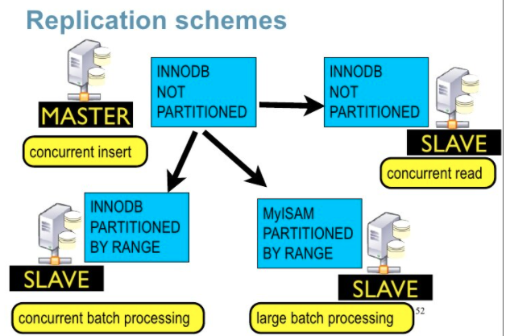

# MySQL Partitioning PoC

In this PoC, we will dive into [MySQL Partitioning](https://dev.mysql.com/doc/refman/8.0/en/partitioning.html) to see what we can leverage in terms of performance for large datasets.

**DISCLAIMER**: _This content could not be considered a benchmark as I'm not using a stable environment or any sofisticated tool for that propouse. The results exposed here are a collection os commands read from the official documentation and executed using DBeaver on my personal laptop, so the results are not accurated and amy change if you run this many times._

### When to use partitions?
The best definition found on my researches were those below:
* if you have large tables
* if you know that you will always query for the partition column
* if you have historical tables that you want to purge quickly
* if you indexes are large than the available RAM

### Why to use partitions?
* to make single inserts and selects faster
* to make rangle selects faster
* to split data across different paths
* if you need to delete large chunk of data instantaly

---
## Setup the environment
Start up stack
```bash
docker-compose up
```

Stop stack
```bash
docker-compose stop
```

Clean up stack
```bash
docker-compose down
```

The command above will create a mysql container and execute the init script that will do the following tasks:
* create a table with 11 partitions by `year`
* create and execute a procedure to insert 4M random data on the partitioned table. _The execution of this procedure can take time (4 hours on my laptop), adjust the amount of data you want to start with._
* create a non-partitioned table and copy all data from the previous one.   

---
## Running the tests and check the results
The statements were execute three times to avoid cache divergencies.

### SELECT statements
```sql
-- partitoned
SELECT COUNT(*) 
  FROM foo_part 
```

Output:
```
count(*) |
---------+
  4000000|

Tooks: 1.4s, 579ms, 558ms
```

```sql
-- partitoned
SELECT COUNT(*) 
  FROM foo_part 
 WHERE created > DATE '1995-01-01' AND created < DATE '1995-12-31'
```

Output:
```
count(*)|
--------+
  397582|

Tooks 3.86s, 243ms, 240ms
```

Let's run the `EXPLAIN` to see what MySQL does: 
```sql
-- explain
EXPLAIN SELECT COUNT(*)
          FROM foo_part 
         WHERE created > DATE '1995-01-01' AND created < DATE '1995-12-31'
```

Output:
```
id|select_type|table   |partitions|type|possible_keys|key|key_len|ref|rows  |filtered|Extra      |
--+-----------+--------+----------+----+-------------+---+-------+---+------+--------+-----------+
 1|SIMPLE     |foo_part|p1        |ALL |             |   |       |   |370188|   11.11|Using where|
```
**NOTE:** the command _explain_ shows that MySQL runs only against the partition 1 (p1)


### Now let's see the result when execute the same query against a table without partitioning

```sql
-- non-partitoned
SELECT COUNT(*) 
  FROM foo_non_part 
```

Output:
```
count(*) |
---------+
  4000000|

Tooks: 1.4s, 404ms, 408ms
```

```sql
-- non-partitioned		 
SELECT COUNT(*) 
  FROM foo_non_part 
 WHERE created > DATE '1995-01-01' AND created < DATE '1995-12-31'
```

Output:
```
count(*)|
--------+
  397582|

Tooks: 26.5s, 26.5s, 26.5s
```

Let's run the `EXPLAIN` again
```sql
-- explain
EXPLAIN SELECT COUNT(*)
		  FROM foo_non_part 
		 WHERE created > DATE '1995-01-01' AND created < DATE '1995-12-31'
```

Output:
````
id|select_type|table       |partitions|type|possible_keys|key|key_len|ref|rows   |filtered|Extra      |
--+-----------+------------+----------+----+-------------+---+-------+---+-------+--------+-----------+
 1|SIMPLE     |foo_non_part|          |ALL |             |   |       |   |3985803|   11.11|Using where|
````
**Note:** explain shows that MySQL runs a full table scan.


We can get more information about an specific database (schema) partitions running the command below:
```sql
select * from information_schema.PARTITIONS p where p.TABLE_SCHEMA = 'partitioned_db'
```

### ADD COLUMN
```sql
-- PARTITIONED
ALTER TABLE foo_part ADD COLUMN new_column VARCHAR(15);
--Tooks: 324ms

ALTER TABLE foo_part ADD COLUMN new_column_with_value VARCHAR(15) DEFAULT 'foo';
--Tooks: 342ms
```
```sql
-- NON PARTITIONED
ALTER TABLE foo_non_part ADD COLUMN new_column VARCHAR(15);
--Tooks: 54ms

ALTER TABLE foo_non_part ADD COLUMN new_column_with_value VARCHAR(15) DEFAULT 'foo';
--Tooks: 40ms

```

### ADD INDEXES
```sql
-- PARTITIONED
CREATE INDEX idx_name_fulltext ON foo_part (name)
--Tooks: 27s
```
```sql
-- NON PARTITIONED
CREATE INDEX idx_name_fulltext ON foo_non_part (name)
--Tooks: 29s
```

### INSERT statement
```sql
-- PARTITIONED
insert into foo_part values (10000001,'inserting one','1998-01-01');
--Tooks: 10ms, 9ms, 11ms
```
```sql
-- NON-PARTITIONED
insert into foo_non_part(id,name,created) values (10000001,'inserting one','1998-01-01');
-- Tooks: 10ms, 8ms, 9ms
```

### UPDATE statement
  ```sql
-- PARTITIONED
UPDATE foo_part SET name=CONCAT(name," - ", YEAR(created)) 
 WHERE created > DATE '1995-01-01' AND created < DATE '1995-12-31';
 -- 397582 row(s) updated - 27s
```

 ```sql
-- NON-PARTITIONED
UPDATE foo_non_part SET name=CONCAT(name," - ", YEAR(created)) 
 WHERE created > DATE '1995-01-01' AND created < DATE '1995-12-31';
 -- 397582 row(s) updated - 52s
```

### DELETE statement
```sql
-- PARTITIONED
DELETE FROM foo_part WHERE created = DATE '1995-12-31'
-- 1328 row(s) updated 0 - 524ms
```	

```sql
-- NON-PARTITIONED
DELETE FROM foo_non_part WHERE created = DATE '1995-12-31'
-- 1328 row(s) updated 0 - 40s
```
*Note:* Using partitions we also have optiont o delete the entire partition and its data instantly without blocks.

### Modifying Partitions

Partitining a table with more than 4M rows
```sql
ALTER TABLE foo_non_part 
PARTITION BY RANGE (year(created)) 
(
    PARTITION p0 VALUES LESS THAN (1995),
    PARTITION p1 VALUES LESS THAN (1996) , 
    PARTITION p2 VALUES LESS THAN (1997) ,
    PARTITION p3 VALUES LESS THAN (1998) , 
    PARTITION p4 VALUES LESS THAN (1999) ,
    PARTITION p5 VALUES LESS THAN (2000) , 
    PARTITION p6 VALUES LESS THAN (2001) ,
    PARTITION p7 VALUES LESS THAN (2002) , 
    PARTITION p8 VALUES LESS THAN (2003) ,
    PARTITION p9 VALUES LESS THAN (2004) , 
    PARTITION p10 VALUES LESS THAN (2010),
    PARTITION p11 VALUES LESS THAN MAXVALUE 
);
-- Updated 4845666 rows - 59s
```

Removing table partitioning
```sql
ALTER TABLE foo_non_part REMOVE PARTITIONING
-- Updated 4845666 rows - 52s
```

There are a lot more we can do modifying partitions using the ALTER TABLE stattement, for more detail check the [documentation](https://dev.mysql.com/doc/refman/8.0/en/alter-table.html)

## Partitions and Replication
There are a lot of options we can use partitioning with a replication environment. We can have a `master` non-partitioned replicating to a `slave` partitioned for instance, among the other combinations.

  
Source: https://www.slideshare.net/datacharmer/partitions-performance-with-mysql-51-and-55

## Wrapping-up
There are many options to perform the managment of partitions in mysql see [check here](https://dev.mysql.com/doc/mysql-partitioning-excerpt/8.0/en/partitioning-management.html).

If the partition key is well defined, we can reduce drastically the amount of data to filter and it means less disc access, more efficient usage of cache and so on.

With physical partition will be hard to rebalance or merge again, with logical partitioning we can balance easily.

### References

* https://dev.mysql.com/doc/refman/8.0/en/partitioning.html
* https://dev.mysql.com/doc/refman/8.0/en/partitioning-maintenance.html
* https://www.slideshare.net/datacharmer/partitions-performance-with-mysql-51-and-55
* https://www.youtube.com/watch?v=FYDIgDAHVCY
